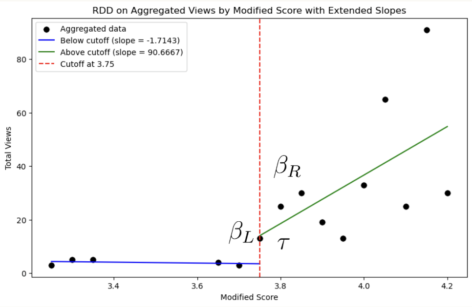
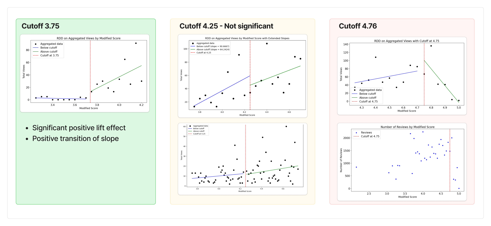
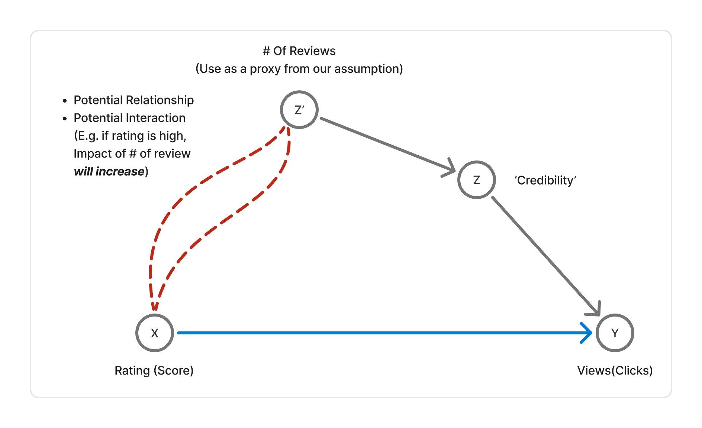
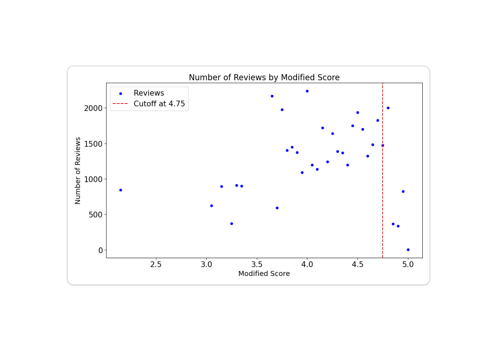

# TripadvisorA_RDD_Analysis
RDD Analysis for Tripadvisor Bubble Rating

# Summary

***Does bubble rating have a positive causal impact on increasing views of postings for hotels on Tripadvisor? Is it actually beneficial to the business?***

## Background

* Many of the platform services, including Tripadvisor, utilize 'Bubble Rating' system, which represents a numerical rating on a '5 Stars' (or bubble) scale. 
* Since the bubble rating system represents scores in units of 0.5 bubbles (e.g. 0.5 stars, or 1 complete star), most of the services **round up** actual numerical ratings to the closest 0.5 unit.

## Questions

* However, from some perspectives, bubble rating could sometimes be seen as distorting actual data, and could be deceptive to the customers. It **may boost up** views of postings which are rounded up, but it might harm the performance of postings in which their scores are rounded down. 
* Also, in terms of business operations, it is very important to quantitatively measure the size and direction of impact caused by the bubble rating policy.

# Framework

Regression Discontinuity Design is a methodology to measure the causal effect of treatment over the cutoff of the 'running variable'. Without treatment, we assume that the dependent variable (e.g. views or clicks) should have steady or continuous patterns over the running variable - for our case, views increase continuously over the rating. However, if the treatment intervenes in a certain cutoff, or threshold, it will change the amount of effect (treatment effect - the 'lift'), and 'sensitivity' of the running variable's impact on the dependent variable, which is  $\frac{dy}{dx}$. This could be formulated as: 
$$
y = \beta_0 + \beta_1 \cdot \text{Treatment} + \beta_2 \cdot (x-c) + \beta_3 \cdot \text{Treatment} \cdot (x - c) + \epsilon
$$
Where $c$ is the cutoff. From the example RDD plot below, we could measure the following with the coefficients from the regression above:

|         | Measure           | Interpretation                                               |
| ------- | ----------------- | ------------------------------------------------------------ |
| \beta_R | \beta_2 + \beta_3 | Slope after treatment: sensitivity of views on rating after treatment. |
| \beta_L | \beta_2           | Slope before treatment: sensitivity of views on rating before treatment. s |
| \tau    | \beta_1           | Treatment effect on the cutoff                               |

# Results and conclusion

We could get the following conclusion through running RDD analysis. 

|                  | Cutoff 3.75          | Cutoff 4.25           | Cutoff 4.75                   |
| ---------------- | -------------------- | --------------------- | ----------------------------- |
| Treatment effect | High and Positive    | Not significant       | High and Positive             |
| Slope change     | Positively Increased | No significant change | Turned negative from positive |

# Summary

From cutoff 3.75, through rounding up scores to 4.0 we could see a significant jump on views. Also, we could observe that before score 3.75 slope was flat, but it became highly positive after the cutoff. **This implies 4.0+ is the range of rating that people begin to perceive the score to be high and important.** At the same time, scores between the range of 3.5~3.75 are being rounded down to 3.5. Customers perceive scores 3.5 or lower to be low, probably implying low quality. Therefore, under score 3.5, hotels are less likely to get more views even rating increase. 

From cutoff 4.25, the rounding effect seems to be insignificant. Both slope change and treatment effect were measured to be minimal. **This implies from 4.0~4.5, in terms of the customer perspective, hotels are less differentiated by rating.**  4.0, or 4.2, are treated almost equally good as 4.4, or 4.5. 

After the cutoff of 4.75, we could see a positive treatment effect, but interestingly slope turned negative. This implies that in the high-rating range, people are less likely to view hotels if the rating is high.

# Sensitivity on 'rating counts' - Interaction term regression. 

 Since the results on the high rating range are counterintuitive, we made a hypothesis that this could be an omitted variable that affects the view-rating count. When we usually see a very high rating with a small number of reviews, we tend to doubt the credibility of the rating. 

# DAG

Therefore, we made a hypothesis that the number of reviews is working as a proxy for 'credibility', and credibility affects the views. Also, since we spotted a negative relationship between rating and views only in the higher rating range, ***we assumed the impact of 'review count' on views increases as rating increases ***. Therefore, we went through regression by adding an  interaction term between rating and number of reviews:
$$
\text{Views} = \beta_0 + \beta_1 \cdot \text{Rating} + \beta_2 \cdot \text{Review Count}  + \beta_3 \cdot \text{Rating} \cdot \text{Review Count} + \epsilon
$$
Here, if we see a positive coefficient ($\beta_3$), this means the impact of review count actually increases as rating increases. 

As a result, we observed $\beta_3 = 0.0483$. This implies an impact difference of review count when rating is 5,which  is  **66.7%** higher compared to when rating is 3. (When rating is 3, 1 additional review may increase 0.1314 views, while it will increase 0.219 views when rating is 5.)

By observing data, we could observe number of ratings dropped significantly after rating 4.75. 
